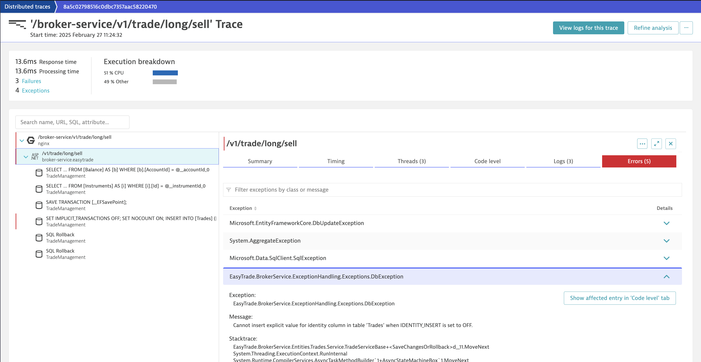

# Dynatrace Basic Observability

## Version & Compatibility

Tested with ACE-Box version 1.28.8

## Value

Real world scenario of Dynatrace monitoring an application running in a Kubernetes cluster, providing visibility into:
- APM & Logs
- Application Security
- Infrastructure & Resource consumption

Using a realistic environment you will run through similar scenarios to the ones provided in the documentation, in order to learn:
- [Drill-down to service failure causes](https://docs.dynatrace.com/docs/analyze-explore-automate/distributed-traces/use-cases/error-analysis)
- [Use logs in context to troubleshoot issues](https://docs.dynatrace.com/docs/analyze-explore-automate/logs/lma-use-cases/lma-e2e-troubleshooting) _coming soon..._
- [Assess and troubleshoot cluster health](https://docs.dynatrace.com/docs/observe/infrastructure-monitoring/container-platform-monitoring/use-cases/cluster-health) _coming soon..._
- [Optimize workload resource usage with Kubernetes app and Notebooks](https://docs.dynatrace.com/docs/observe/infrastructure-monitoring/container-platform-monitoring/use-cases/resource-optimization) _coming soon..._
- [Troubleshoot common health problems of Kubernetes workloads](https://docs.dynatrace.com/docs/observe/infrastructure-monitoring/container-platform-monitoring/use-cases/troubleshoot-health-problems) _coming soon..._
- [Visualize and analyze security findings](https://docs.dynatrace.com/docs/secure/use-cases/visualize-and-analyze-security-findings) _coming soon..._

> Note: there are not exactly the same use cases as in the documentation, but you can see the instructions below